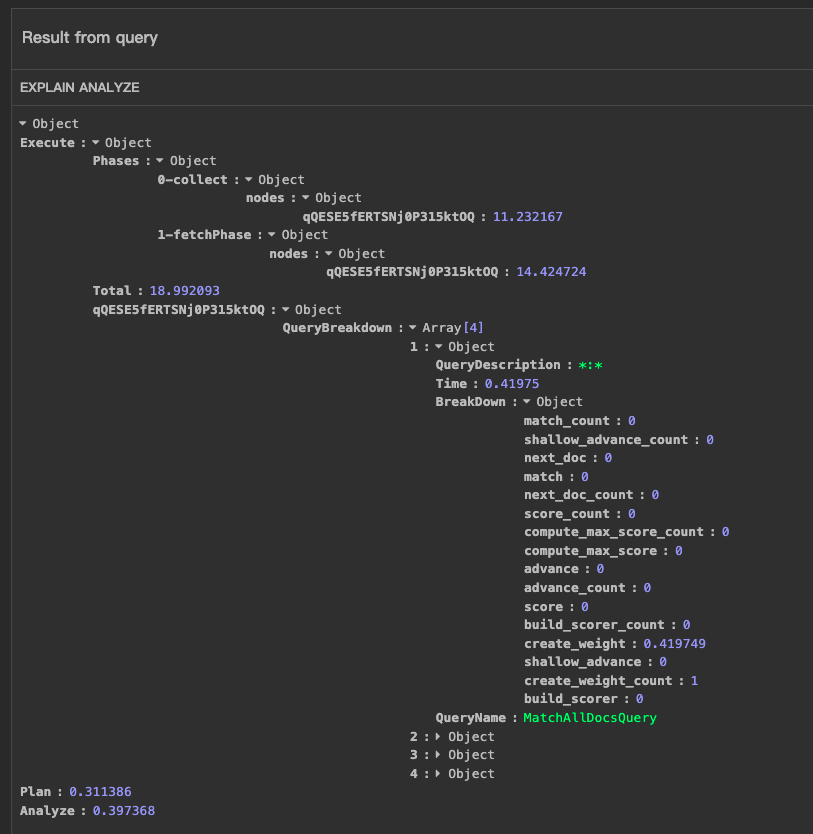
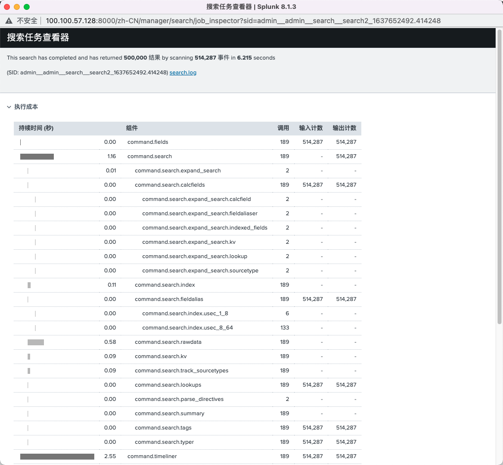

# 性能剖析(profiling)

[TOC]

## 1. 背景

Profiling（剖析）用于性能，资源的监控，包括

- CPU Profiling 分析查询负载的瓶颈
  - 查询耗时在那个函数、模块上，以及资源利用效率
- Headp Profiling 分析内存使用，定位于排查内存泄漏


Profiling 这个词更多使用在应用系统外，在linux操作系统层面上执行的性能分析，如perf，pprof，arthas这样profiler工具，来分析应用系统的性能。 

而在系统内角度，系统开发人员对系统的性能分析视角，监控问题，通常被归属于系统的可观测性（Observability)，涉及三个子领域（tracing，metrics，logging），tracing 类似于CPU Profiling，一般通过埋点方式，记录wall time（墙上时钟时间，即真实时间），分析请求链路的执行时间。


## 2. Profiling原理

### 2.1 CPU Profiling

linux 上cpu profiling分析工具

分类：

- **Instrumentation** 检测
  - 在每个routine的开始和结束处插入特殊代码来记录routine何时开始和结束
  - 方式
    - 源代码修改
    - 二进制
      - 在内存中将检测插入到可执行代码
  - 优点
    - 实际时间（wall time）
  - 缺点
    - 检测代码本身的开销，容易干扰于短和高频的routine
  - 工具
    - gprof（检测和采样混合），gperftools（多线程，google）
- **Sampling** 采样
  - 记录操作系统定期中断CPU执行进程切换时执行的指令，并将记录的执行点与链接过程中的routine和源代码相关联，显示应用程序运行期间执行routine和源代码行的频率（火焰图）
    - stack trace + statistics
  - 优点
    - 无需修改代码
    - 运行开销很小
  - 缺点
    - 统计近似值而不是实际时间
    - 可能并未记录Off-CPU
  - 工具
    - perf


### 2.2 Heap Profiling

内存Profiling与CPU Profiling类似，同样可以根据stack trace + statistics或者统计真实申请的方式来统计各函数的内存分配。

由于内存分配是很频繁的操作，一种方式（Golang）是按一定粒度大小（512K）进行采样。（为了解决采样bais问题，粒度大小可以设置为服从正太分布的随机值）

另一种方式（C/C++，Golang提供内存分配工具），创建内存分配器对象，从更底层的内存分配池获取空闲缓存块（块设置不同大小的粒度，1K，2M等）进行分配和回收，记录每个类或者功能模块，独立申请的内存空间大小，定期或者接受信号时，打印各功能模块的内存使用。


## 3. 数据库Profiling实现

### 3.1 OceanBase

时间统计对象

```C++
// 算子监控
ObMonitorNode  
  int64_t open_time_;
  int64_t first_row_time_;
  int64_t last_row_time_;
  int64_t close_time_;
  int64_t rescan_times_;
  int64_t output_row_count_;
  int64_t memory_used_;
  int64_t disk_read_count_;
```


ObPhyOperator

- 成员
  - ObMonitorNode
  -  lib::MemoryContext
- 方法
  - get_next_row中设置
    - op_monitor_info\_.first_row_time_
    - op_monitor_info\_.output_row_count_
    - op_monitor_info\_.last_row_time_
  - close
    - op_monitor_info\_close_time_


`ObOpSpec::create_operator_recursive()` 创建算子时，设置open_time_

CREATE_PHY_OPERATOR_CTX 创建算子上下文时，设置open_time_


ObMergeJoin

- 继承OBJoin
  - 继承ObDoubleChildrenPhyOperator
    - 继承ObPhyOperator


`ObExecTimestamp` 记录了计划执行过程各个时间戳

- ExecType { InvalidType = 0, MpQuery, InnerSql, RpcProcessor, PLSql }
- rpc_send_ts_
- receive_ts_ 接收到请求时间
- enter_queue_ts_ 
- run_ts_ 解码后开始执行时间
- before_process_ts_
- single_process_ts_ 单独sql的开始执行是回见
- process_executor_ts_ 开始执行时间
- executor_end_ts_

`ObReqTimestamp` 


`ObAuditRecordData` 审计日志

- `ObExecTimestamp`
- `ObExecRecord`


`sql/executor/ob_bkgd_dist_task.h`

`ObDistExecuteBaseP`

- RpcProcessor类型
- process_timestamp_
  - ` ObExecStatUtils::record_exec_timestamp()`
- exec_start_timestamp_
- exec_end_timestamp_

`ObBKGDDistTask` 后台执行的分布式task

- create_time_us_ 任务创建时间
- ObDistTaskProcessor  继承ObDistExecuteBaseP


总结：

- 节点算子记录，算子的执行各个时间戳
- 分布式计划Task，也在Task对象中维持各个时间戳属性
- 最后基于时间戳，计算各个阶段的执行时间


### 3.2 spark


### 3.3 TiDB

#### 3.3.1 性能监控 （tracing）

- [trace 语法](https://docs.pingcap.com/zh/tidb/stable/sql-statement-trace)， 函数级别执行时间
  - 通过opentracing-go 在session文件，和关键算子如tableReader上的关键方法，如next进行埋点。

- [explain analyze 语法](https://docs.pingcap.com/zh/tidb/stable/sql-statement-explain-analyze)  算子级别的执行时间，行数等统计
  - time 表示从进入算子到离开算子的全部 wall time，包括所有子算子操作的全部执行时间
    - 实现方式，`time.Since(start))`，直接加到到算子的统计信息

  - loops 是当前算子被父算子调用的次数
  - 分布式执行计划，各个task 的平均时间

- TiDB Dashboard 提供了 [Statements](https://book.tidb.io/session3/chapter2/statements.html) 用来监控和统计 SQL，可视化
  - SQL 级别，分类性能，采样保存具体sql执行时间
    - trace + explain analyze 的算子的统计信息
  - [dashborad sql分析执行详情](https://docs.pingcap.com/zh/tidb/stable/dashboard-statement-details)

SQL 语句实际指的是某一类 SQL 语句。语法一致的 SQL 语句会规一化为一类相同的 SQL 语句。

单个 Statements 详情页关键信息：

1. SQL 执行总时长
2. 平均影响行数（一般是写入）
3. 平均扫描行数（一般是读）
4. 各个节点执行指标（可以快速定位出某个节点性能瓶颈）

需要可视化 Statements原因：

- Grafana 不能排查单条 SQL 的性能问题
- Slow log 只记录超过慢日志阀值的 SQL
- General log 本身对性能有一定影响
- Explain analyze 只能查看可以复现的问题
- Profile 只能查看整个实例的瓶颈


```
// explain analyze功能实现
// tidb-> tikv 请求运行时统计信息
type selectResultRuntimeStats struct {
	copRespTime      []time.Duration
	procKeys         []int64
	backoffSleep     map[string]time.Duration
	totalProcessTime time.Duration
	totalWaitTime    time.Duration
	rpcStat          tikv.RegionRequestRuntimeStats
	CoprCacheHitNum  int64
}
// 算子的统计信息
executor/index_lookup_join.

每个算子存在一个统计信息,如indexLookUpJoinRuntimeStats，记录各个算子执行的特定的统计信息
实现接口execdetails.RuntimeStats
util/execdetails/execdetails.go

统计时间是，直接基于每次next时间add
```


#### 3.3.2 Heap Profiling

TiDB组件

方式：基于采样

工具：

- go pprof
- 执行算子的内存跟踪器成员`	memTracker *memory.Tracker // track memory usage.`


sysbench 结果：

- 512k 采样记录的性能损耗基本都在 1% 以内
- 全记录TPS/QPS 缩水了 20 倍，P95 延迟增加了 30 倍

TiKV组件

方式：基于采样

工具：

- jemalloc （rust）

go-ycsb 结果：

- OPS 相较默认内存分配器下降了 4% 左右，P99 延迟线上升了 10% 左右
  - tcmalloc与jemalloc性能类似


### 3.4 PolarDB-X

PolarDB-X 是阿里云开源的一个HTAP数据库，特性：

- 语言：java
- 支持MPP
- 支持向量化执行

**CpuProfile**

- `ExplainExecutorUtil`
  - explain 语法提供多种执行模式，在analze模式可以显示各算子的真实执行时间
- `RuntimeStatistics`
  - 实现接口 `CpuCollector` 记录各个task的cpu时间
  - 继承`RuntimeStat`  提供 一个sql的 cpu和内存统计信息
  - 被放进执行上下文ExecutionContext在各个阶段进行填充
  - 各物理执行算子`Executor` 创建时检查`ExecutionContext`是否存在`RuntimeStatistics`, 存在时，通过`RuntimeStatHelper.registerStatForExec()` 注册物理执行算子的统计信息`OperatorStatisticsGroup`到`RuntimeStatistics`
    - 示例`polardbx-executor/src/main/java/com/alibaba/polardbx/executor/mpp/operator/factory/LimitExecFactory.java`
    - 另一种方式通过`setPlanTree()` 方法初始化注册算子的统计信息
      - 例如explain
  - `collectMppStatistics()` 收集MPP方式执行的task中的算子的统计信息
    - 每个MPP 执行的的task的统计信息存储在`TaskStatus`中
      - 一个task中可能包含多个物理算子
    - `HttpRemoteTask`
      - 通过注册的监听器到task任务状态fetcher，在task 完成后，触发执行收集动作，将`TaskStatus` 中的信息添加到`RuntimeStatistics`
        - 粒度：物理执行算子在整个集群机器的cpu时间消耗（累计时间，未像spark独立显示处理每个分区的task执行时间）
- `OperatorStatisticsGroup` [并行]执行的算子的统计信息（cpu时间，行数）对应一个逻辑的关系表达式节点`RelNode` 如sort，Scan，Join等
  - `toSketchExt()`
    - `RuntimeStatisticsSketchExt` 统计信息概览
- `MemoryStatisticsGroup` 并行执行的task的内存的统计信息， 自包含结构
  - `TaskMemoryStatisticsGroup` 单个task
- `CallableWithCpuCollector`
  - 对执行的线程的任务的cpu时间进行收集，封装
  - `CallableWithStatHandler`
  - `CpuCollector` cpu时间计时存储器、span
- `polardbx-executor/src/main/java/com/alibaba/polardbx/executor/operator/AbstractExecutor.java` 物理执行算子抽象类
  - 通过`enableCpuProfile` 和 `OperatorStatistics` 来决定是否记录算子的执行时间
    - 算子的统计信息中包含属性
      - `rowCount`
      - `memory`
      - `startupDuration`  open时间
        - CPU or network time during opening in nanoseconds
        - `beforeOpen()` 记录开始时间
          - ` ThreadMXBean.getCurrentThreadCpuTime();`  java虚拟机实现的支持测量当前线程的cpu时间，ns 
            - 性能，可能被禁用，[`isThreadCpuTimeEnabled()`](https://docs.oracle.com/javase/8/docs/api/java/lang/management/ThreadMXBean.html#isThreadCpuTimeEnabled--)
        - `afterOpen()`
      - `processDuration` next时间
        - `CPU or network time during execution in nanoseconds`
      - `closeDuration` close时间
        - CPU or network time during closing in nanoseconds
      - `workerDuration` 工作线程时间
        - 实际未使用,  目前看起来 其他时间都是cpu时间，而非真实时间（wall time）
      - `spillCnt`  内存撤销计数？


**内存管理**：

- `MemoryPool`  逻辑的内存分配器树节点，用于管理记录JVM系统的内存使用情况
  - `allocateReserveMemory()`
  - `destroy()` 释放
    - 释放前一般记录该内存池的最大使用大小。如各个物理执行算子通过`collectMemoryUsage()` 方法将其记录到`OperatorStatistics`对象中
      - `polardbx-executor/src/main/java/com/alibaba/polardbx/executor/operator/AbstractExecutor.java` 物理执行算子抽象类

- `MemoryAllocatorCtx` 接口

  - `polardbx-optimizer/src/main/java/com/alibaba/polardbx/optimizer/memory/OperatorMemoryAllocatorCtx.java`

  - `OperatorMemoryAllocatorCtx`  物理执行算子如`HashGroupJoinExec`根据运行过程中，使用的各种对象如Block，调用其`estimateSize` 方法计算其大小，然后通过内存分配器上下文，记录生气的内存
    - `allocateReservedMemory()` 记录分配的内存
      - 调用`MemoryPool.allocateReserveMemory()`


`polardbx-optimizer/src/main/java/com/alibaba/polardbx/optimizer/chunk/Block.java`

- `Chunk` polardb 的 一批数据的接口（列存格式）

  - `estimateSize`  Estimate the memory usage in bytes of this block

  - `getSizeInBytes `  Returns the logical size of this block in memory (逻辑上，但是可能block中有空闲)


Java 对象内存大小计算工具类

`polardbx-common/src/main/java/com/alibaba/polardbx/common/utils/memory/ObjectSizeUtils.java`

`polardbx-common/src/main/java/com/alibaba/polardbx/common/utils/memory/SizeOf.java`


### 3.5 crate

CrateDB 是一个分布式 SQL 数据库，面向机器数据的存储和分析。（Java）

特性：

- SQL
- Lucene

**时间跟踪**

create 提供`explain analyze` 语法可以提供对查询（select）语句的执行时间的跟踪。

示例：

`explain analyze select * from t1 limit 100; `



crate将select 分成3个大的阶段，Analyze（语法分析）,Plan（生成执行计划）,Execute（查询执行）。

 一般查询的主要耗时还在在Execute阶段。如截图显示，Phases 代表在各个节点上执行的Operation（0-collect; 1-fetchPhase）的时间(ms)。Total记录了整个Execute的时间。涉及使用 Lucene 执行的查询，用时记录在查询细分QueryBreakdown中，包括每个查询分片的详细信息（时间单位也是ms），截图显示了四个分片，`create_weight`对象为查询创建并作为含有状态的临时对象的时间。

**源码实现分析**：

`ProfilingContext ` profiling上下文

- 存储了各个阶段的执行时间。
- 跨越analyzer, planner, executor层
- 成员变量
  - `HashMap<String, Double> durationInMSByTimer` 
    - Key：阶段名称，value：用时
    - `io.crate.profile.Timer` 对象代表一个节点的用时
  - `List<QueryProfiler> profilers` 记录ES查询执行的profiler信息
    - `QueryProfiler` 继承`org.elasticsearch.search.profile.AbstractProfileBreakdown`
      - 记录查询执行期间可能发生的各种操作的计时记录

`server/src/main/java/io/crate/analyze/ExplainStatementAnalyzer.java`

- 语法分析阶段，创建ProfilingContext 对象，并开始记录analyze 阶段的用时

`server/src/main/java/io/crate/planner/Planner.java`

- `visitExplainStatement()` 逻辑计划生成阶段记录plan用时

`io.crate.execution.jobs.RootTask`

- 创建RootTask时，传入`ProfilingContext ` ，通过事件监听器，监听task开始和完成任务的时间，并放入到`ProfilingContext ` 

- 在`start()` 方法每个orderedTasks 对应一个phase 创建对于的计时器，并设置开始时间

- `TaskFinishedListener` 通过task完成监听器，在task执行完成后停止计时器的计时。

  

`server/src/main/java/io/crate/planner/node/management/ExplainPlan.java`

- `executeOrFail()` 记录Execute开始时间，基于逻辑计划，生成节点的`NodeOperationTree`, 等待真实查询执行计划的完成，通过future执行`createResultConsumer()` 根据jobid向各节点发起收集执行时间的action，并格式化合并显示。

**内存监控**

`MemoryManager` 内存管理，分配ByteBuf

- 堆内
- 堆外


总结：

- `ProfilingContext `  对象记录整个计划大的阶段时间，并传递给各个executor
- `io.crate.profile.Timer` 对象记录一个时间区间，开始和结束
- Task为粒度，记录执行时间
- 基于Future回调，监听器完成时间的收集


### 3.6 Splunk

搜索任务查看器

这个工具来解决搜索性能问题，同时还能决定搜索在哪个阶段花费的时间最多。它会对搜索行为进 行详细分析，从而帮助了解有关知识对象（如事件类型、标记、查找和搜索内的其他组件）执行成本的信息。

任务界面>

搜索命令，用户，事件数量，大小，搜索时间。

检查任务

通过检查任务可以进一步了解搜索在做什么，以及 Splunk 软件把大部分时间花在什么地方。

使用“搜索任务查看器”查看当前任务的相关信息，如搜索 ID (sid)、任务执行成本和搜索任务属性。

1. 在特定任务的操操作作列中，选择任任务务。

2. 选择检检查查任任务务。

   有关“搜索任务查看器”使用的更多信息，请参阅“查看搜索任务属性”。

示例：搜索命令：`index="_audit"`



执行成本记录了spl执行的各个函数的时间，调用次数，输入和输出行数。

### 3.7 Mysql

```
启动profiling:
set @@profiling=1;
关闭profiling ：
set @@profiling=0;


1.查看profile记录
show profiles;

Duration:需要时间；
query：执行的sql语句；

+----------+------------+----------------+
| Query_ID | Duration   | Query          |
+----------+------------+----------------+
|        1 | 0.07553700 | show databases |
|        2 | 0.01575200 | show databases |
+----------+------------+----------------+
2 rows in set, 1 warning (0.04 sec)

2.查看详情：
mysql> show profile for query 1;
+----------------------+----------+
| Status               | Duration |
+----------------------+----------+
| starting             | 0.006942 |
| checking permissions | 0.001303 |
| Opening tables       | 0.027913 |
| init                 | 0.001905 |
| System lock          | 0.000569 |
| optimizing           | 0.000339 |
| statistics           | 0.002483 |
| preparing            | 0.002378 |
| executing            | 0.022062 |
| Sending data         | 0.000654 |
| end                  | 0.000558 |
| query end            | 0.000021 |
| closing tables       | 0.000051 |
| removing tmp table   | 0.003717 |
| closing tables       | 0.000551 |
| freeing items        | 0.000025 |
| cleaning up          | 0.004066 |
+----------------------+----------+
17 rows in set, 1 warning (0.00 sec)

show profile for query 2;

mysql> show profile for query 2;
+----------------------+----------+
| Status               | Duration |
+----------------------+----------+
| starting             | 0.005657 |
| checking permissions | 0.000013 |
| Opening tables       | 0.001107 |
| init                 | 0.000534 |
| System lock          | 0.000011 |
| optimizing           | 0.000003 |
| statistics           | 0.000009 |
| preparing            | 0.000007 |
| executing            | 0.007676 |
| Sending data         | 0.000025 |
| end                  | 0.000005 |
| query end            | 0.000005 |
| closing tables       | 0.000003 |
| removing tmp table   | 0.000008 |
| closing tables       | 0.000003 |
| freeing items        | 0.000052 |
| cleaning up          | 0.000634 |
+----------------------+----------+
17 rows in set, 1 warning (0.00 sec)

 
3.查看cup和io情况
show profile cpu,block io for query 2;

mysql> show profile cpu,block io for query 2;
+----------------------+----------+----------+------------+--------------+---------------+
| Status               | Duration | CPU_user | CPU_system | Block_ops_in | Block_ops_out |
+----------------------+----------+----------+------------+--------------+---------------+
| starting             | 0.005657 | 0.000035 |   0.000231 |            0 |             0 |
| checking permissions | 0.000013 | 0.000005 |   0.000008 |            0 |             0 |
| Opening tables       | 0.001107 | 0.000044 |   0.000388 |            0 |             0 |
| init                 | 0.000534 | 0.000016 |   0.000190 |            0 |             0 |
| System lock          | 0.000011 | 0.000004 |   0.000006 |            0 |             0 |
| optimizing           | 0.000003 | 0.000002 |   0.000001 |            0 |             0 |
| statistics           | 0.000009 | 0.000008 |   0.000001 |            0 |             0 |
| preparing            | 0.000007 | 0.000008 |   0.000002 |            0 |             0 |
| executing            | 0.007676 | 0.000151 |   0.003309 |            0 |             0 |
| Sending data         | 0.000025 | 0.000016 |   0.000009 |            0 |             0 |
| end                  | 0.000005 | 0.000003 |   0.000002 |            0 |             0 |
| query end            | 0.000005 | 0.000004 |   0.000001 |            0 |             0 |
| closing tables       | 0.000003 | 0.000001 |   0.000001 |            0 |             0 |
| removing tmp table   | 0.000008 | 0.000006 |   0.000002 |            0 |             0 |
| closing tables       | 0.000003 | 0.000003 |   0.000001 |            0 |             0 |
| freeing items        | 0.000052 | 0.000020 |   0.000032 |            0 |             0 |
| cleaning up          | 0.000634 | 0.000030 |   0.000264 |            0 |             0 |
+----------------------+----------+----------+------------+--------------+---------------+
17 rows in set, 1 warning (0.01 sec)
```


## REF

- [TiDB 重要监控指标详解](https://docs.pingcap.com/zh/tidb/stable/grafana-tidb-dashboard)
- [TiDB trace 语法](https://docs.pingcap.com/zh/tidb/v3.1/sql-statement-trace)
- [TiDB explain analyze 语法](https://docs.pingcap.com/zh/tidb/stable/sql-statement-explain-analyze)
- [TiDB Statements](https://book.tidb.io/session3/chapter2/statements.html)
- [TiKV 高性能追踪的实现解析](https://pingcap.com/zh/blog/implementation-analysis-of-tikv-high-performance-tracking) 
  - tikv 认为开源的opentracing rust实现一次准确时间获取50ns，耗时过多，影响了性能，自己实现的tracing 一个span的开销可以降低到20ns， 总成本从原来的50% 降低到5%以下。
- [github:crate ](git@github.com:crate/crate.git)
- [crate explain analyze](https://github.com/crate/crate/blob/master/docs/sql/statements/explain.rst)
- [CPU Profiling Tools on Linux](http://euccas.github.io/blog/20170827/cpu-profiling-tools-on-linux.html)
- [内存泄漏的定位与排查：Heap Profiling 原理解析](https://pingcap.com/zh/blog/an-explanation-of-the-heap-profiling-principle?utm_source=wechat&utm_medium=social&utm_campaign=heap-profiling)
- [Brendan Gregg perf](https://www.brendangregg.com/perf.html) 性能之巅作者博客
- [mysql show-profile](https://dev.mysql.com/doc/refman/8.0/en/show-profile.html)
- [PolarDB-X](https://github.com/ApsaraDB/galaxysql)  ApsaraDB/galaxysql
- [Java虚拟机线程系统的管理接口 ThreadMXBean](https://docs.oracle.com/javase/8/docs/api/java/lang/management/ThreadMXBean.html)


扩展材料：

- [[译] 使用 Linux tracepoint、perf 和 eBPF 跟踪数据包 (2017)](https://arthurchiao.art/blog/trace-packet-with-tracepoint-perf-ebpf-zh/)

- [[译] Cilium：BPF 和 XDP 参考指南（2021）](https://arthurchiao.art/blog/cilium-bpf-xdp-reference-guide-zh/)

- [Netflix: 一分钟内的 Linux 性能分析](https://netflixtechblog.com/linux-performance-analysis-in-60-000-milliseconds-accc10403c55)

  - ```
    uptime
    dmesg | tail
    vmstat 1
    mpstat -P ALL 1
    pidstat 1
    iostat -xz 1
    free -m
    sar -n DEV 1
    sar -n TCP,ETCP 1
    top
    ```


