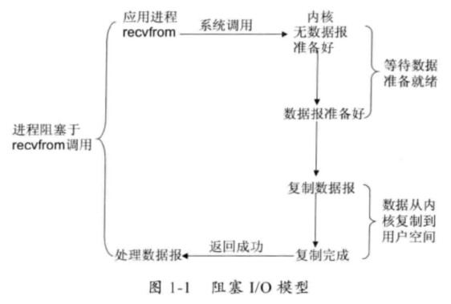
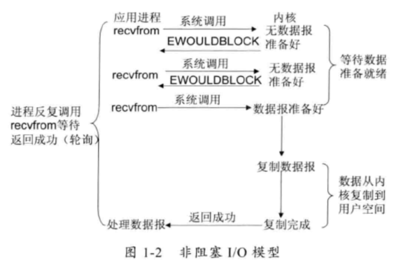
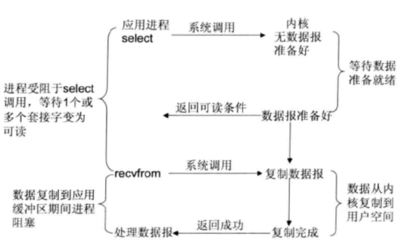
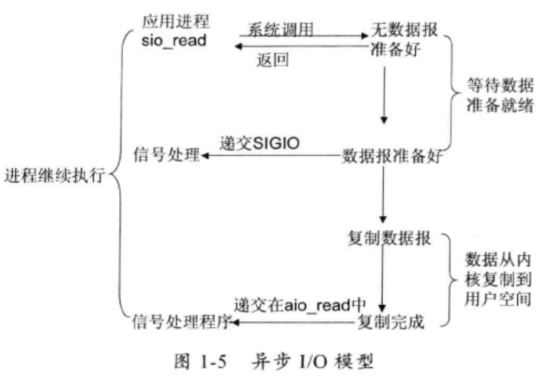
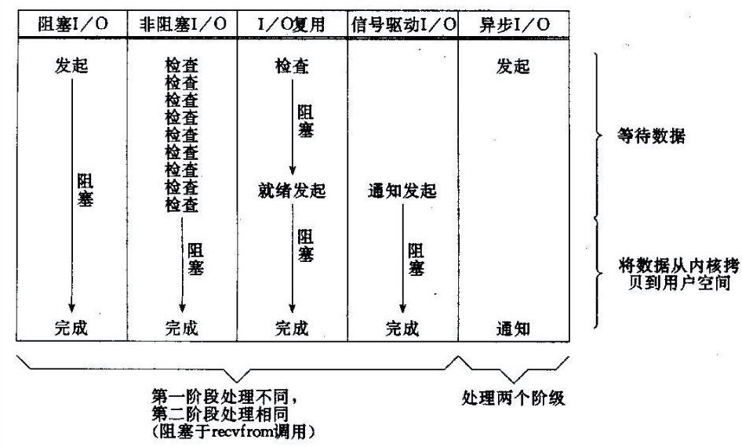

# Java知识点

## 1. 反射与代理

反射：运行过程中，对于任意类，可以获取该类的所有属性和方法。任意对象，调用它的任意方法和属性（包括私有）。

优点：

- 动态加载类

缺点：

- 性能瓶颈

  

（argodbbar client 与master通信，rpc框架）

其他参考：笔记[UML与设计模式-笔记.md](https://github.com/tianjiqx/notes/blob/master/software_project/UML/UML%E4%B8%8E%E8%AE%BE%E8%AE%A1%E6%A8%A1%E5%BC%8F-%E7%AC%94%E8%AE%B0.md) 介绍了远程代理

### REF

- [java反射机制](https://mp.weixin.qq.com/s?__biz=MzI1NDU0MTE1NA==&mid=2247483785&idx=1&sn=f696c8c49cb7ecce9818247683482a1c&chksm=e9c2ed84deb564925172b2dd78d307d4dc345fa313d3e44f01e84fa22ac5561b37aec5cbd5b4&scene=0#rd)  java核心技术卷1 5.7 
- hadoop 技术内幕common，mapreduce，yarn
- hadoop 权威指南4版

## 2. 线程池

导入导出项目中，并发实现。

```java
//ThreadPoolExecutor
  /**
   * 用于下载文件的线程池
   */
  private ThreadPoolExecutor downloadThreadPool;

 /*
* corePoolSize：核心大小，线程池初始化的时候，就会有这么大
* maximumPoolSize：线程池最大线程数
* keepAliveTime：如果当前线程池中线程数大于corePoolSize。
* 多余的线程，在等待keepAliveTime时间后如果还没有新的线程任务指派给它，它就会被回收
*
* unit：等待时间keepAliveTime的单位
*
* workQueue：等待队列。
**/  
 // Init the thread pool to download file
    downloadThreadPool = new ThreadPoolExecutor(impExpContext.exportThreadPoolSize,
        impExpContext.exportThreadPoolSize, 0L,
        TimeUnit.MICROSECONDS,
        new LinkedBlockingQueue<Runnable>(impExpContext.exportThreadPoolQueueSize),
        Executors.defaultThreadFactory(), new BlockWhenQueueFullHandler()
        );

    fileTaskQueue = new LinkedBlockingQueue<>(impExpContext.exportFileQueueSize);
	// 执行，SubFileDownloader继承了runable 接口
	downloadThreadPool.execute(new SubFileDownloader(subFileInfo, activeCount,
            hadoopContext.dfs, hadoopContext.ccf));
/**
ThreadPoolExecutor是线程池的核心实现类，用来执行被提交的任务。
ScheduledThreadPoolExecutor是一个实现类，可以在给定的延迟后运行命令，或者定期执行命令。 ScheduledThreadPoolExecutor比Timer更灵活，功能更强大。
*/
```

在hadoop的源码中的使用线程池，发现也是继承ThreadPoolExecutor的HadoopThreadPoolExecutor（org.apache.hadoop.util.concurrent包目录下），增加日志。


### REF

- [Java多线程之ThreadPoolExecutor详解使用](https://www.cnblogs.com/dim2046/p/12059073.html)

- [java&android线程池-Executor框架之ThreadPoolExcutor&ScheduledThreadPoolExecutor浅析（多线程编程之三）](http://blog.csdn.net/javazejian/article/details/50890554)


## 3.JNI参考文档

（NBU项目，使用到jni技术）

官方API说明：

https://docs.oracle.com/javase/8/docs/technotes/guides/jni/spec/jniTOC.html

Java Native Interface(JNI)从零开始详细教程：

https://blog.csdn.net/createchance/article/details/53783490#t18

编译相关：在 Linux 平台下使用 JNI

https://developer.ibm.com/zh/articles/l-linux-jni/

JNI最佳实践（编码的性能与正确性）

https://developer.ibm.com/articles/j-jni/

JNI语法相关（注意接口需要  (*env)->，方式，并传递env）：

https://github.com/glumes/AndroidDevWithCpp

JNI技术规范

**https://www.jianshu.com/p/88fbe27621fc**


## 4.Java NIO

（ArgoDBBAR项目，网络通信机制依赖netty；数据拷贝性能改进使用到filechannel）

### IO分类

- 同步阻塞I/O：socket.read()，如果TCP RecvBuffer里没有数据，函数会一直阻塞，直到收到数据，返回读到的数据
- 非阻塞IO：数据未准备好时，也能正常返回，准备好时，正常处理数据
- IO复用：linux的select/poll机制，支持多个fd的读写，顺序扫描fd状态，以支持IO复用
  - epoll：基于事件驱动代替select/poll的顺序扫描
- NIO：基于IO复用的非阻塞IO，事件驱动
- AIO(异步IO)：不但等待就绪是非阻塞的，就连数据从网卡到内存的过程也是异步的。内核通知IO完成













### 概念

Selector：多路复用器。用以轮询注册的channel是否就绪，就绪后进行IO操作

Channel：通道

Buffer：缓冲区


### REF

- [Java NIO浅析-美团技术团队](https://tech.meituan.com/2016/11/04/nio.html)
- [Java NIO 系列教程-并发编程网译文](https://ifeve.com/java-nio-all/)
- Netty权威指南 第2版-李林峰


## 5. java classloader

classloader技术：

双亲委托，避免重复加载class，保留优先层级关系

1.java class标识， 二进制的class定义（来源与jar包或其他方式）和对应的classLoader唯一标识该类

两个class比较的时候， 如isInstance, asInstance，任意一个不匹配将认为不等

2.通过new创建的对象，继承父对象的Class loader，在一个已经存在的对象，方法中通过setContextClassLoader修改classloader不会生效，new的对象仍然是默认的AppClassLoader
Thread.currentThread().setContextClassLoader(classLoader)可修改线程的ClassLoader
只有在修改之后，通过反射创建的对象，这个对象再创建的对象会是修改后的classloader

3.继承的对象load时，先load自身，再load父类
依然使用该class loader并且子类与类自身的classLoader可不同（通过自定义的classLoader，override loadClass方法中指定其他的classloader可以做到）
但是，子类与父类接口参数返回值使用的class的class Loader，需要保持一致，否则运行时报错


应用：spark 支持兼容版本hive，Presto 支持不同数据源， 联邦计算项目


## 6. Java性能诊断技巧

jstack:线程分析，找项目相关类方法

jmap：定期打印，查看异常变量，对象

jstat: 查看GC频率

arthas: trace,watch命令，分析性能，变量，查找抛出异常的位置

GC日志打印，停顿时间


### REF

- 深入理解Java虚拟机JVM高级特性与最佳实践 第2版-周志明
- Java 虚拟机 3 ： Java的类加载机制
  https://crazyfzw.github.io/2018/07/05/classloader/
-  JVM和ClassLoader
  https://www.cnblogs.com/Ming8006/p/11818218.html
- Spark对HiveMetastore客户端的多版本管理、兼容性探究以及栅
  栏实现 https://blog.csdn.net/zhanyuanlin/article/details
  /95898018  

