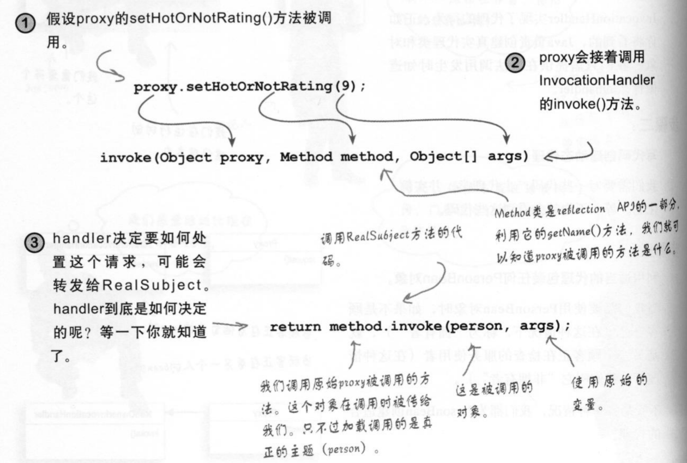
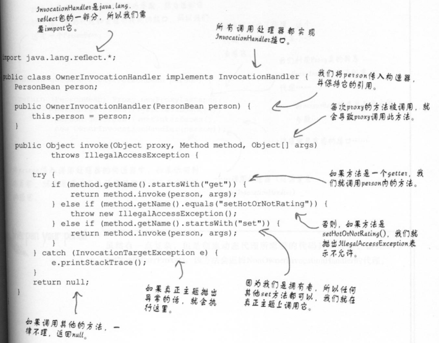
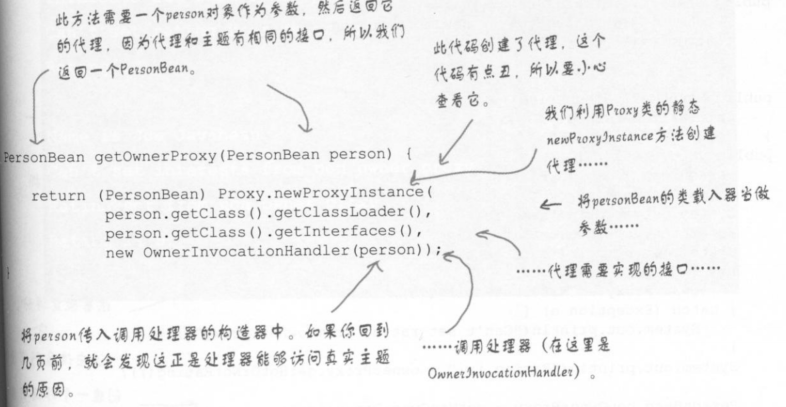
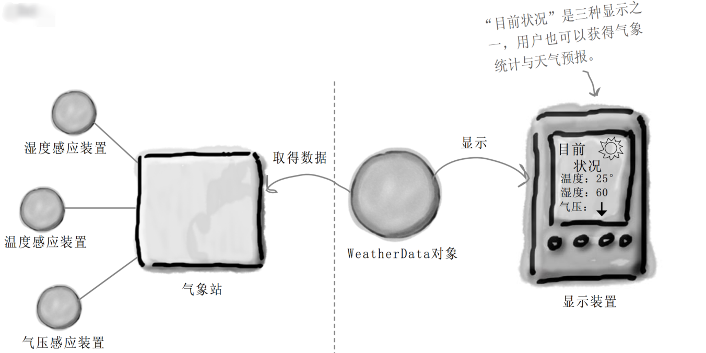
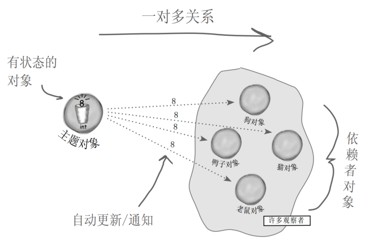
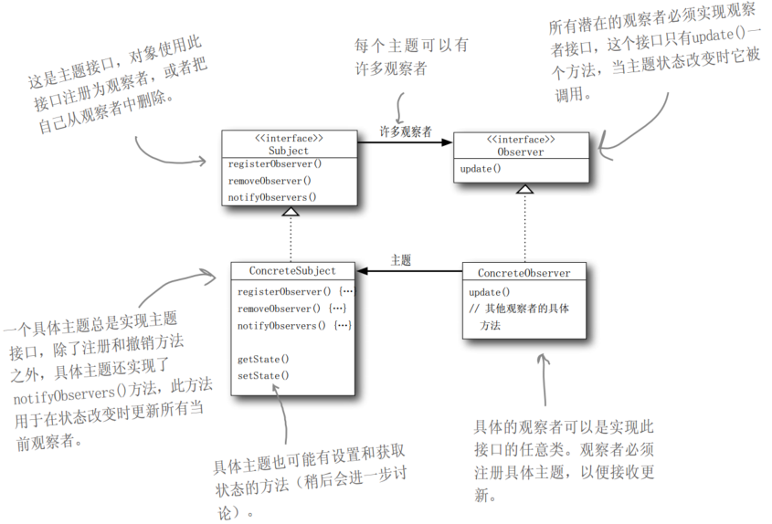
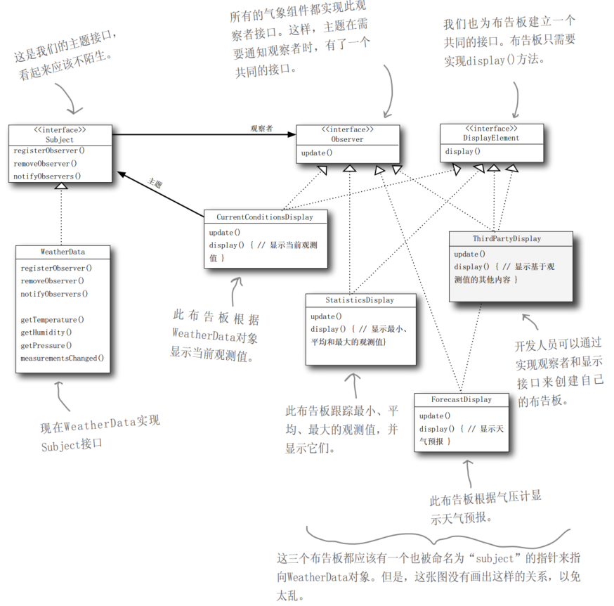
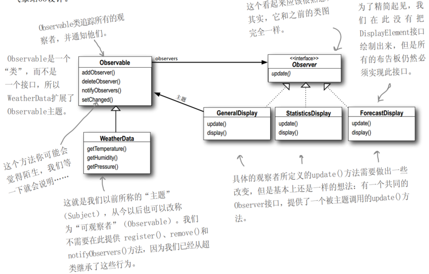
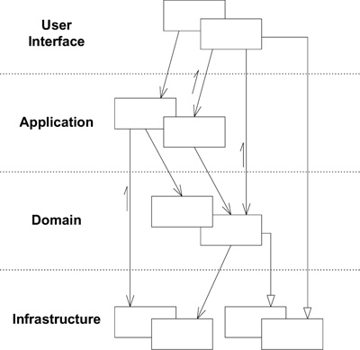

# UML与设计模式-笔记

[TOC]

## 常用UML符号


### 3.关系

#### 3.1依赖


#### 3.2  关联


has a

#### 3.3 继承


接口实现关系，线条是虚线，箭头是三角。

巧记：**UML中符号，箭头都是目标，宾语。**

## 鸭子的设计：策略模式

（head first设计模式第一章）

<u>需求总是不断变化的，设计继承的父类，难以抽象出一个基础原子性的父类，牵一发而动全身</u>（动物鸭子会叫，会游泳，会飞，而橡皮鸭不会叫，会飞），甚至一个如何考虑一个鸭鸣器（只会叫，用以吸引鸭子）。

倒不如是一个完全空的抽象概念。

使用**接口**，抽象出能力（会飞，会叫），接口的组合胜于继承。

接口，解决只有一部分类型具有的能力。  接口的缺点，怎样复用能力，行为的重载。解决版本是使用组合而非继承接口，has a 而不是 is a。

设计原则：找出应用中可能需要变化之处，独立出来，隔离不需要变化的代码。


对于被隔离的变化的行为，不再定义在自己的类（或子类）的方法，而是使用**代理**delegate，交给其他类处理。


总结：多用（接口）组合，少用（接口）继承。

鸭子的设计模式，除了代理模式思想，也是

**策略模式**：定义算法族分别封装起来，让他们之间可以互相替换，让算法的变化可以独立于使用算法的客户。（行为模式）

OO原则

- 封装变化
- 多用组合，少用继承
- 针对 接口编程，不针对实现编程


## 代理模式

代理——黑脸、白脸：**控制和管理**访问

跨JVM的对象的访问。

#### 远程代理：万能糖果公司CEO的糖果机监视器


代理模式：为另一个对象提供一个替身或者站位符以控制对这个对象的访问。(结构模式)

（被代理对象可以是远程的对象，创建开销大的对象，或者需要安全控制的对象，远程代理，虚拟代理，保护代理）


(Proxy 即存根，在RMI自动生成，动态代理，运行时动态创建代理类，实现一个或多个接口，并将方法转发到所指定的类)

（通过动态代理，RMI使用存根stub，skeleton方式以及被取代了）

#### 虚拟代理

使用场景举例:显示CD封面，虚拟代理，代理Icon，在未从网络下载到真实CD封面时，显本地固定图片，下载完成后，显示真实CD封面。

最简单的异步思想：启动一个线程，后台执行。

解耦：代理将客户端与图片显示解耦，不必同步等待远程图片服务下载完成。

装饰者增加对象行为，代理控制对象的访问。

适配器改变对象适配的接口，而代理实现相同的接口。

#### 动态代理


Proxy由java自动产生，所以，proxy要做的事情，全放到了InvocationHandler中了。InvocationHandler：响应代理的调用，实际代理对象需要执行的操作。

例子：

动态代理，实现保护功能，保护代理。

对象村的对象匹配（探探）。

对象，可以设置自己的兴趣，爱好，等属性，额外评分属性是其他对象设置（平均评分），自己不能设置，其他对象也不能设置他人的兴趣爱好。

根据这个需求限制，通过保护代理来实现。

为对象提供两个代理，OwnerInvocationHandler, 作为拥有者代理的调用处理器，可以设置对象的个人属性；NonOwnerInvocationHandler，设置评分。

代理调用机制：



Method类 reflection API，提供getName，获取代理调用的方法名。

OwnerInvocationHandler：



（method.invoke()执行代理对象的特定方法，参数，代理对象，方法参数）

创建Proxy类并实例化proxy对象（拥有者的代理对象）：



创建动态代理类的参数：

类加载器、代理对象的接口集，InvocHandler。

总结：

代理Proxy类，运行时才创建，并实例化，所以称之为动态。

InvocationHandler类，只有一个invoke方法，用以处理代理类的方法被调用时，需要执行的动作，但是与代理类的接口，完全解耦。在本例中的应用是，通过Method.invoke()选择性的执行调用被代理对象的方法，被屏蔽的方法抛出异常，这里体现了代理的特点，控制被代理对象的访问。

注意：一个代理实例，只有一个InvocationHandler实例，但是可以有编写多个InvocationHandler类（本例中的拥有者和非拥有者），用于创建不同的代理实例。

应用：rpc的实现。


更多的代理变种：

防火墙代理：控制网络资源的访问

智能引用代理：subject被引用时，增加引用计数次数

缓存代理：对运算开销大的结果暂时存储，多个客户共享结果

同步代理：多线程下的安全访问

复杂隐藏代理：或者叫外观代理，控制访问。

写时复制代理：控制对象的复制，延迟对象的复制。


## 气象监测：观察者模式

背景：

气象站的各种物联网设备收集信息，WeatherData是气象站提供的原始数据对象，显示是设计的目标应用接受气象站信息并显示，显示装置不止一种（目前状况，气象统计，天气预报等），考虑未来有多种视图的扩展（增加/删除）。



实现容易出现的问题：

- 针对具体实现编程而非接口（设计各个显示类，对各个显示类的对象直接更新属性）


观察者模式：

定义对象之间的一对多的依赖，当一个对象改变状态时，它所有的依赖者都将受到通知并自动更新。（行为模式）



观察者模式类图：




设计原则：为交互对象之间的松耦合设计而努力

新的设计：



观察者实现的方式：

- 由主题，推送
- 由观察者，拉取

java内置的观察者模式（java.util.Observable,java.util.Observer）：



注意：

- java.util.Observable的notifyObservers()方法表示，观察自己拉取更新（利用subject对象，获取信息），而notifyObservers(Object arg)表示推更新（arg）给观察者。

  采用拉取方式，可以只拉取观察者需要的信息。

- Observable是一个类，其通知观察者的顺序，可能由于观察者的变更，而变更。使用内置观察者模式时，不要依赖观察者被通知的顺序。

现实使员工场景：

GUI编程，事件监听器。


## 行为模式

属于行为模式的模式：

策略模式、观察者模式，状态模式，迭代器模式，中介者模式，模板方法模式，访问者模式，责任链模式。

特点：

### 封装变化

当一个程序的某个方面的特征经常发生改变时 ，这些模式就**定义一个封装这个方面的对象**。

这样当该程序的其他部分依赖于这个方面时，它们都可以与此**对象协作**。

这些模式通常定义一个抽象类来描述这些封装变化的对象，并且通常该模式依据这个对象来命名。

例如，
• 一个S t r a t e g y对象封装一个算法（S t r a t e g y）。
• 一个S t a t e对象封装一个与状态相关的行为（S t a t e）。
• 一个M e d i a t o r对象封装对象间的协议（M e d i t a t o r）。
• 一个I t e r a t o r对象封装访问和遍历一个聚集对象中的各个构件的方法（I t e r a t o r）。  

### 对象作为参数


### 通信被封装还是被分布


### 对发送者和接收者解耦

观察者模式：主题和观察者的松耦合。


##　关于建模

模型是对现实的简化。

模型提供了系统的蓝图。每个系统可以从不同方面用不同的模型进行描述。

可以是结构性的，强调系统的组织。

可以是行为性的，强调系统的动态方面。

建模，为了更好的理解正在开发的系统。（更好的理解现有的系统）

－可视化系统

－规约系统的结构或行为

－指导构造系统的模板

－对做出的决策进行文档化

### 建模原理

- 选择适合解决问题的模型
  - 如数据库开发者观点，实体-联系模型，结构化开发者，算法为中心的数据流模型，面向对象开发人员，体系结构，一组类和交互模式为中心。更广泛的，适用的是面向对象的方法。
- 在不同的精度级别上表示每一种模型
  - 解决分析人员，用户，“做什么”问题
  - 解决开发人员。“怎么做”问题
- 与现实相联系的模型
  - 分析模型与设计模型的联系
- 单一模型或视图是不充分的
  - 面向对象的：用例图（系统需求），设计视图（问题空间和解空间），交互视图（各部分，系统与环境的联系），实现视图（物理实现），部署视图（系统的工程问题）。每种视图都有结构和行为方面。

系统的性质，决定各种模型的重要性。

数据密集型：静态设计图

图形密集型：用例图

硬实时系统：动态进程视图

分布式系统：实现模型和部署模型

面向对象的建模——UML，统一建模语言

（可视化，详述，构造，文档化）

独立于过程，以用例为驱动，以体系结构为中心，迭代和增量的过程。

体系结构分层：用户界面层，业务服务层和数据库层。

（数据仓库的体系结构，实时流系统体系结构，AI平台的体系结构等）


## 《领域驱动设计：软件核心复杂性应对之道》

### 一.运用领域模型

#### 1.消化知识与使用

建立并使用领域专家，开发人员共同认可的术语。

**沟通场景、需求**，描述行为，动作影响等，使用术语构建，而非开发人员具体实现。

术语——接口

具体代码——实现

**领域模型：在实现、设计和团队交流中使用同一个模型作为基础。**

建模对象，如果包含所有编码对象，细节过多，导致“只见树木，不见森林”

解释性模型，区别与对象模型

#### 2.绑定模型与实现

MODEL-DRIVEN DESIGN（模型驱动设计）不再将**分析模型**和**程序设计分**离开，而是寻求一种能够满足这两方面需求的单一模型。不考虑纯粹的技术问题，程序设计中的每个对象都反映了模型中所描述的相应概念。

不能够因为技术考虑而削弱分析的功能，也不能接受那些只反映了领域概念却舍弃了软件设计原则的拙劣设计

软件系统各个部分的设计应该忠实地反映领域模型，以便体现出这二者之间的明确对应关系。

##### 建模范式和工具支持

Prolog 语言。在 MODEL-DRIVEN DESIGN 中，建模范式是逻辑，而模型则是**一组逻辑规则**以及这些规则所操作的**事实**。

改变代码就意味着改变模型。

模型要**支持有效的实现**并**抽象出关键的领域知识**。

（疑问：模型所反映的领域结构，在计算和存储上的效率？就像对象-关系模型。如果完全按照模型设计，存储对象，而非关系表，在数据库方面，不得不面临极大压力，损失效率）

### 二、模型驱动设计的构造块

### 4.分离领域

#### 4.1 层次结构模式




domain 层：领域层。

一个架构能够把那些与领域相关的代码隔离出来，得到一个内聚的领域设计，同时又使领域与系统其他部分保持松散耦合，那么这种架构也许可以支持领域驱动设计。


#### 4.2 表示

##### 实体

在整个生命周期中具有连续性；独立于对应用程序用户很重要的属性的区别的任何事物。

需要不可变的唯一标识

##### value object

对象没有概念上的标识，它们描述了一个事务的某种特征。一般情况下不可变，为性能而可变（本身频繁改变，创建开销，无共享）。

##### 关联，对象之间

易于控制的技巧：

- 单向，避免相互依赖
- 限定，1对多变成1对1
- 消除比必要的管理

```java
public class BrokerageAccount {
    String accountNumber;
    Customer customer;
    Set investments;
  // Constructors, etc. omitted
  public Customer getCustomer() {
    return customer;
  }
  public Set getInvestments() {
    return investments;
  }
}
// 每支股票只能对应于一笔投资
=>
public class BrokerageAccount {
  String accountNumber;
  Customer customer;
  Map investments;
  // Omitting constructors, etc.
  public Customer getCustomer() {
    return customer;
  }
  public Investment getInvestment(String stockSymbol) {
    return (Investment)investments.get(stockSymbol);
  }
}
```

##### Services

一组操作，而非事物。

1. 与领域概念相关的操作不是 ENTITY 或 VALUE OBJECT 的一个自然组成部分。
2. 接口是根据领域模型的其他元素定义的。
3. 操作是无状态的，任何客户都可以使用某个service实例，无关历史。

划分到各层中。

##### 模块，打包

粗粒度的建模和设计元素；概念集合；

低耦合高内聚

##### 范式

- 对象范式
- 关系范式


#### 聚合AGGREGATE

> 假设我们从数据库中删除一个 Person 对象。这个人的姓名、出生日期和工作描述要一起被删除，但要如何处理地址呢？可能还有其他人住在同一地址。如果删除了地址，那些 Person 对象将会引用一个被删除的对象。如果保留地址，那么垃圾地址在数据库中会累积起来。虽然自动垃圾收集机制可以清除垃圾地址，但这也只是一种技术上的修复；就算数据库系统存在这种处理机制，一个基本的建模问题依然被忽略了。

需要找到一个使对象间冲突较少而固定规则联系更紧密的模型

用一个抽象来封装模型中的引用。AGGREGATE 就是一组相关对象的集合，我们把它作为数据修改的单元。每个 AGGREGATE 都有一个根（root）和一个边界（boundary）。边界定义了 AGGREGATE 的内部都有什么。根则是 AGGREGATE 所包含的一个特定 ENTITY。对 AGGREGATE 而言，外部对象只可以引用根，而边界内部的对象之间则可以互相引用。除根以外的其他 ENTITY 都有本地标识，但这些标识只在 AGGREGATE 内部才需要加以区别，因为外部对象除了根 ENTITY 之外看不到其他对象。

> 汽车修配厂的软件可能会使用汽车模型。如图 6-2 所示。汽车是一个具有全局标识的 ENTITY：我们需要将这部汽车与世界上所有其他汽车区分开（即使是一些非常相似的汽车）。我们可以使用车辆识别号来进行区分，车辆识别号是为每辆新汽车分配的唯一标识符。我们可能想通过 4 个轮子的位置跟踪轮胎的转动历史。我们可能想知道每个轮胎的里程数和磨损度。要想知道哪个轮胎在哪儿，必须将轮胎标识为 ENTITY。当脱离这辆车的上下文后，我们很可能就不再关心这些轮胎的标识了。如果更换了轮胎并将旧轮胎送到回收厂，那么软件将不再需要跟踪它们，它们会成为一堆废旧轮胎中的一部分。没有人会关心它们的转动历史。更重要的是，即使轮胎被安在汽车上，也不会有人通过系统查询特定的轮胎，然后看看这个轮胎在哪辆汽车上。人们只会在数据库中查找汽车，然后临时查看一下这部汽车的轮胎情况。因此，汽车是 AGGREGATE 的根 ENTITY，而轮胎处于这个 AGGREGATE 的边界之内。另一方面，发动机组上面都刻有序列号，而且有时是独立于汽车被跟踪的。在一些应用程序中，发动机可以是自己的 AGGREGATE 的根。

固定规则（invariant）是指在数据变化时必须保持的一致性规则，其涉及 AGGREGATE 成员之间的内部关系。而任何跨越 AGGREGATE 的规则将不要求每时每刻都保持最新状态。通过事件处理、批处理或其他更新机制，这些依赖会在一定的时间内得以解决。但在每个事务完成时，AGGREGATE 内部所应用的固定规则必须得到满足.

##### Factory

创建复杂对象
