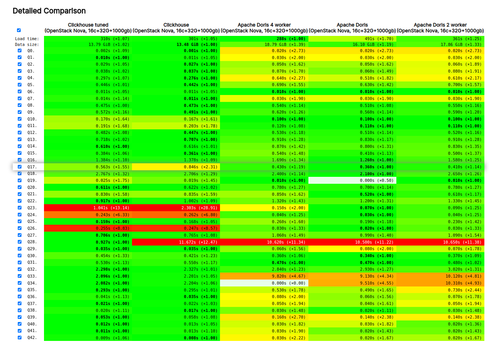

# ClickBench

| 操作系统 | Ubuntu 22.04 |
| ---- | ------------ |
| vCPU | 16           |
| 内存   | 32GiB        |
| 硬盘   | 1TB       |
| 指令集  | 支持avx2 指令集   |
| JVM  | java17       |
| swap | swap off     |

## load

| 系统                                            | size（GB）      | load time（s） | 压缩比      | 速度（MB/s）  |
| --------------------------------------------- | ------------- | ------------ | -------- | --------- |
| doris（16 buckets， 2.1.3）                      | 15.96         | 503          | 4.39     | 142.50    |
| doris（32 buckets， 2.1.3）                      | 16.1          | 491          | 4.35     | 145.99    |
| doris（16 buckets， 2.1.3, 2workers）            | 17(estimated) | 361          | 4.12     | 198.56    |
| doris（16 buckets， 2.1.3, 4workers）            | 18.79         | 288          | 3.73     | 248.89    |
| **doris（16 buckets，2.1.3，dataX，csv 66G）**     | **15.012**    | **600**      | **4.4**  | **58.69** |
| clickhouse(24.6.1.2462)                       | 13.48         | 301.417      | 5.19     | 237.81    |
| clickhouse-tuned（MergeTree）                   | 13.79         | 309.548      | 5.08     | 231.56    |
| **clickhouse-tuned（MergeTree datax csv 66G）** | **12.89**     | **3440**     | **5.12** | **15.36** |

- clickhouse-tuned：tuned版本，设置 index_granularity 为1024，默认8192。 

- datax 模拟 采集场景 batch方式 写入，相对 olap 文件方式写入性能

- 默认情况下，doris 单线程，使用资源较低，建议是streamloader 导入（最近以及fix 内存泄漏问题）

- 转换问题，csv 66G 生成只有部分数据，并且可能丢失特殊字符，存在特殊字符时，dataX未能发送成功

## query

（doris 一些case 测试应该是测试内存OOM问题，未正常获得结果）

## REF

- [ClickBench](https://benchmark.clickhouse.com/)

